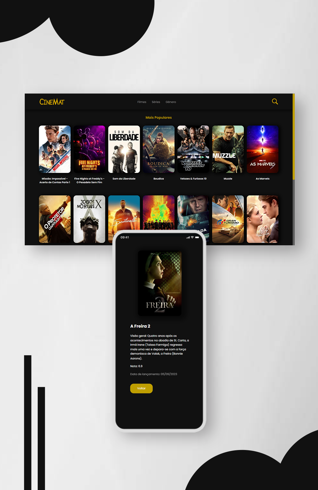

# CineMat - API Filmes

### Projeto desenvolvido para estudos de React + TypeScript

[• Como rodar o projeto](#start) 
[• Skills utilizadas](#leng) 
[• Contato](#contato) 
 

# Visão geral

Navegue pelos filmes como você é acostumado a fazer em suas plataformas preferidas de **streaming**, os filmes são consumidos através de uma API e estão sendo exibidos na categoria **populares**, além de poder navegar entre páginas para ver os filmes que estão em posições inferiores no ranking de **populares**.
 

<h2 align="center">
<a href="https://cinemat.vercel.app/" target="_blank">Testar / preview</a> 
</h1>

    

# Como rodar o projeto

### - Instalação:

### `npm install`

### - Rodar no server local:

### `npm run dev`

 

# Skills utilizadas

  
  

 

# Como entro em contato?

Entre em contato através dos links a seguir!
 
 

 
 
 
